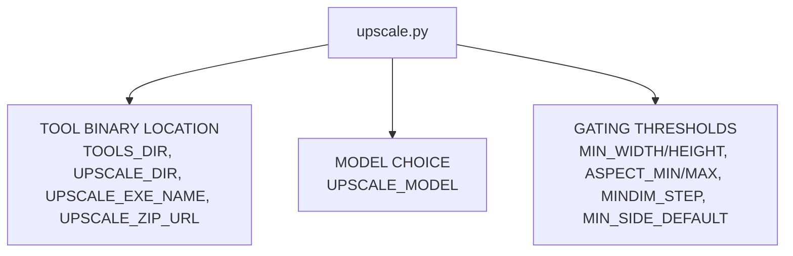

# Upscale Config — Flow

**About:** [description](../__about/upscale.md)

## Structure

## Qualifying rule (read by `upscale_if_small`, engine-side)

    an image qualifies for upscaling WHEN:
        UPSCALE_ASPECT_MIN <= (W / H) <= UPSCALE_ASPECT_MAX
        AND (W < UPSCALE_MIN_WIDTH OR H < UPSCALE_MIN_HEIGHT)
    IF it qualifies:
        upscale native 4x, then LANCZOS down
        so that W >= UPSCALE_MIN_WIDTH AND H >= UPSCALE_MIN_HEIGHT
