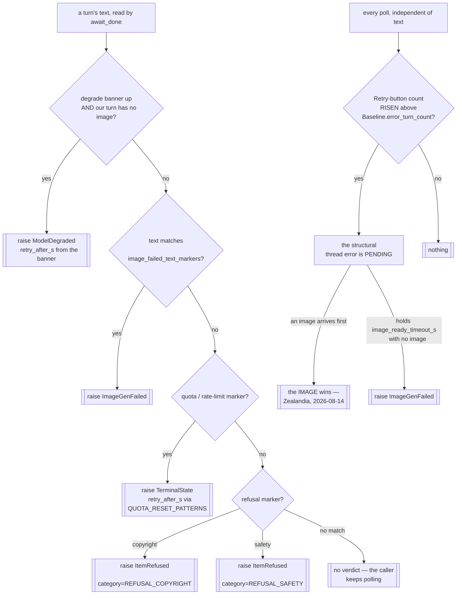

# Driver Classify — Flow

**About:** [description](../__about/classify.md)

## Algorithm — page text in, typed error out

Order matters. The degrade banner is checked BEFORE the quota markers
because the banner's own companion text also matches them, and the
refusal categories are checked MOST-SPECIFIC-FIRST so a copyright
refusal never reads as a generic safety one (the runner picks its
safer-retry preamble from that category).

Pseudocode (language-neutral):

    FUNCTION check_degrade_banner():
        IF the site declares no degrade_banner: RETURN      # silent no-op
        text = the banner's text IF visible ELSE None
        IF text: RAISE ModelDegraded(text, parse_quota_reset(text))

    FUNCTION degrade_banner_text() -> str | None:
        the SAME probe, NON-raising — used AFTER a save, because the
        image can arrive even while the banner is up

    FUNCTION check_markers(text):
        FOR category IN the site's refusal categories, MOST SPECIFIC FIRST:
            IF text matches a quota marker:   RAISE TerminalState(...)
            IF text matches this category:    RAISE ItemRefused(text, category)

    FUNCTION thread_error_risen() -> bool:
        # presence is NOT the verdict: an error turn from an earlier item
        # stays in the chat, and treating that as ours fails every later item
        RETURN count(image_error_retry_button) > baseline.error_turn_count

    FUNCTION check_image_failed(text):
        IF the site ships no image_failed_text_markers: RETURN   # silent no-op
        IF text matches one: RAISE ImageGenFailed(text)
