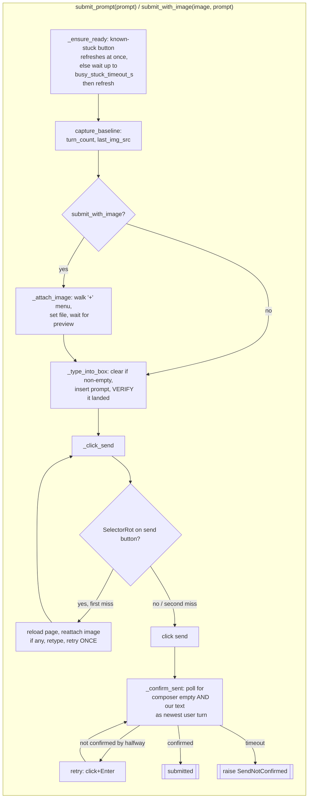

# Driver Protocol — Flow

**About:** [description](../__about/protocol.md)

## Algorithm — one prompt in, provably sent

Pseudocode (language-neutral):

    FUNCTION submit_prompt(prompt):
        ensure_ready()                     # wait out a genuinely busy composer
        baseline = capture_baseline()      # turn_count, last_img_src, user_turn_count
        type_into_box(prompt)              # clear-if-non-empty, insert, VERIFY
        click_send(prompt)                 # ONE reload-recovery retry on SelectorRot
        confirm_sent(prompt)               # poll: composer empty + our text is
                                           # the newest user turn; one mid-window retry
        sent_head = prompt's normalized 60-char head   # the F1b anchor
        sent_norm = prompt's full normalized text      # the TEXT-first anchor

The wait half that judges the result against this submit's `Baseline`
lives in [wait](wait.md).
