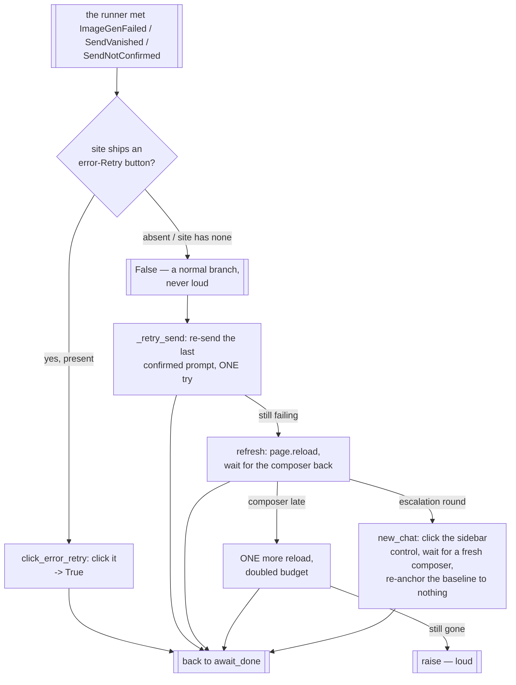

# Driver Recovery — Flow

**About:** [description](../__about/recovery.md)

## Algorithm — one rung at a time

Each box below is a SEPARATE public call. This module never decides how
far to climb: [Recovery Ladder](../../__about/recovery.md) owns that
policy, and calls one rung at a time.

Pseudocode (language-neutral):

    FUNCTION click_error_retry(log) -> bool:
        IF the site declares no image_error_retry_button: RETURN False
        IF the button is not present:                     RETURN False
        click it
        RETURN True                       # never loud — absence is normal

    FUNCTION refresh(log):
        page.reload()
        wait for the composer up to the selector timeout
        IF the composer did not come back:
            page.reload() ONCE more with a DOUBLED budget
            IF still gone: RAISE                # loud
        # the login lives in the profile on disk — nothing to re-enter

    FUNCTION new_chat(log):
        click the sidebar's new-chat control
        wait for the fresh composer
        baseline = None            # a fresh conversation restarts turn numbering

    FUNCTION _retry_send():
        re-send the LAST CONFIRMED prompt — the single try the
        SendVanished / SendNotConfirmed handler is allowed
