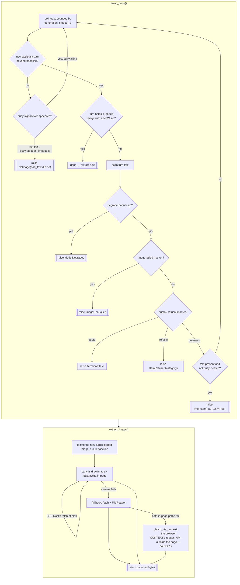

# Driver Wait — Flow

**About:** [description](../__about/wait.md)

## Algorithm — the done edge and the bytes

The verdicts the poll loop reaches (`ModelDegraded`, `ImageGenFailed`,
`TerminalState`, `ItemRefused`) are made by
[classify](classify.md), not here.

Pseudocode (language-neutral):

    FUNCTION await_done():
        baseline = the captured Baseline
        WHILE elapsed < generation_timeout_s:
            # F1b anchor (owner 2026-08-04): ok / vanished / unavailable
            anchor = does the newest USER turn still read as OUR prompt
                     (head present, then text agrees for ANCHOR_VERIFY_CHARS)?
            IF anchor == vanished FOR >= text_settle_s:
                RAISE SendVanished          # site dropped our message —
                                            # runner re-sends the item's OWN prompt
            IF anchor == ok:
                turn = last assistant turn IF it FOLLOWS our user turn
                       in the DOM ELSE None          # count IGNORED (virtualization)
            ELSE:  # unavailable — no user_turn selector / nothing confirmed
                turn = last assistant turn IF conversation grew past baseline ELSE None
            IF turn has a loaded image with src != baseline.last_img_src:
                busy_known_stuck = busy               # a still-set button IS stuck
                RETURN                                # done
            IF turn has text:
                IF degrade_banner up:               RAISE ModelDegraded
                IF text matches image-failed marker: RAISE ImageGenFailed
                IF text matches quota marker:        RAISE TerminalState
                IF text matches refusal marker:      RAISE ItemRefused(category)
                IF text stands alone (not busy) for >= text_settle_s:
                    RAISE NoImage(had_text=True)     # loud skip, never nudge
            ELSE IF not vanished AND nothing new AND busy never appeared
                    past busy_appear_timeout_s:
                RAISE NoImage(had_text=False)        # the one nudge-eligible case
            SLEEP poll_interval
        RAISE GenerationTimeout

    FUNCTION extract_image():
        WHILE elapsed < image_ready_timeout_s:
            img = the new turn's loaded image, src != baseline.last_img_src
            IF img found: BREAK
            check the turn's text for degrade/quota/refusal markers
            SLEEP poll_interval
        TRY canvas drawImage + toDataURL (works even under blob: CSP)
        EXCEPT: fetch(src) + FileReader as fallback
        EXCEPT: the browser CONTEXT's request API (cookies, no CORS)
        RETURN decoded bytes
