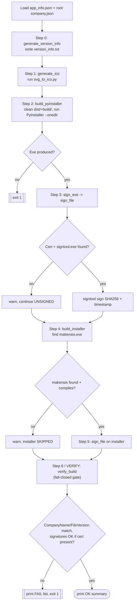

# Build Orchestrator — Flow

**About:** [description](../__about/build.md)

## Algorithm — the 7-step pipeline

Pseudocode (language-neutral):

    LOAD app_info.json, root company.json

    # Step 0
    WRITE version_info.txt from app_info + company metadata

    # Step 1
    RUN svg_to_ico.py → assets/icon.ico

    # Step 2
    CLEAN dist/, build/
    RUN PyInstaller --onedir with project-specific exclude / hidden-import /
        collect-all lists → dist/App/App.exe
    IF exe missing → exit 1
    COPY icon.ico into dist/App/

    # Step 3 — best effort, never aborts the build
    SIGN exe:
        IF cert or signtool.exe missing → warn, continue UNSIGNED
        ELSE → signtool sign (SHA256, DigiCert timestamp)

    # Step 4 — best effort
    IF makensis.exe found:
        COMPILE installer.nsi → dist/App_Setup.exe
        IF compiled OK:
            # Step 5 — best effort, same sign_file() as step 3
            SIGN installer
    ELSE:
        WARN, continue without an installer

    # Step 6 — fail-closed VERIFY gate, always runs last
    READ exe VersionInfo (CompanyName, FileVersion) via PowerShell
    IF CompanyName != company.json.company_name → record problem
    IF app_info.version NOT IN FileVersion → record problem
    IF cert is configured (pfx + password exist):
        FOR EACH of (exe, installer if built):
            IF Authenticode signature status is NotSigned/empty → record problem
    IF any problem recorded:
        PRINT every problem
        EXIT 1
    ELSE:
        PRINT OK summary

**Why a separate verify step:** every earlier step fails *silently* on
its own — PyInstaller without a version file still produces an exe
(just with empty CompanyName), a skipped installer-signing step just
yields an unsigned file, and the build otherwise returns exit 0 while
shipping a broken artifact. `verify_build` asserts on the OUTPUT
(the actual metadata and signatures on disk), not on "did the steps
run", which is what makes drift between this script and the pipeline
contract impossible to ship unnoticed.
