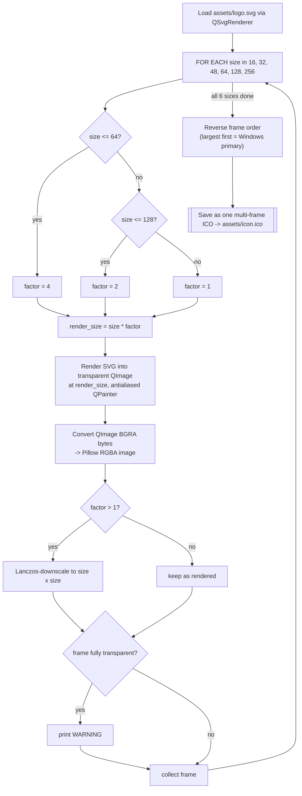

# ICO Generator — Flow

**About:** [description](../__about/svg_to_ico.md)

## Algorithm — adaptive supersample + Lanczos downscale

Pseudocode (language-neutral):

    LOAD svg renderer FROM assets/logo.svg
    (ensure a GUI application instance exists — the SVG renderer needs one)

    frames = []
    FOR EACH size IN [16, 32, 48, 64, 128, 256]:
        factor = 4 IF size <= 64
                ELSE 2 IF size <= 128
                ELSE 1
        render_size = size * factor

        image = render SVG into a transparent canvas of render_size x render_size
                (antialiased)
        image = convert rendered canvas -> RGBA image

        IF factor > 1:
            image = Lanczos-resize(image, size x size)   # supersample-then-downscale
                                                           # for a sharper small icon than
                                                           # a direct render at `size` would give
        IF image is fully transparent → WARN (likely a broken SVG)

        frames.append(image)

    REVERSE(frames)                       # largest frame first — Windows treats the
                                           # first frame in a multi-frame ICO as primary
    SAVE frames[0] AS ICO, append_images = frames[1:]  → assets/icon.ico

**Why supersample at all:** rendering an SVG directly at 16x16 or
32x32 produces visibly soft edges — vector detail collapses at that
pixel count. Rendering at 4x the target and downscaling with Lanczos
preserves edge sharpness the way a real image editor's "render large,
scale down" workflow would. The factor tapers off (4x → 2x → 1x) as
target size grows, since supersampling matters least where there are
already plenty of pixels to work with (256px needs no help).
